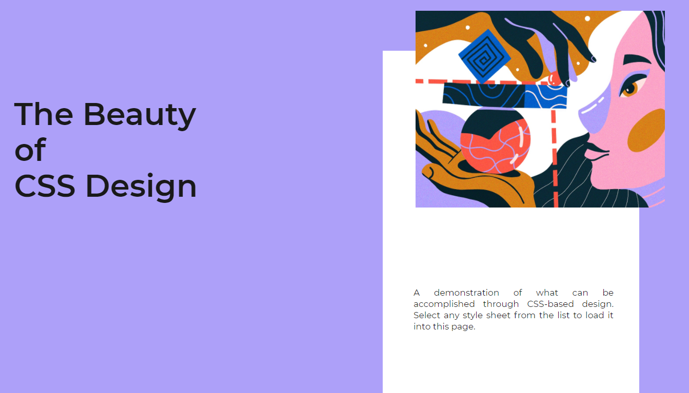

# css-zen-garden-challenge
[Live Demo](https://edumigueis.github.io/css-zen-garden-challenge/) 
---
 The css zen garden challenge. Where, there is a template html that remains unchanged and an blank canvas of css. You can find more info about this challenge at: http://www.csszengarden.com/.

- This app was made with scss to make it easier to code and more browser compatible, since the pre-processor adds multiple property types. For example if you say: height: fit-content; the pre-processor adds moz-fit-content and webkit-fit-content. 
---

## Installation

- To run this project you need to download the files and open the html file in a browser.

### Clone

- Clone this repo to your local machine using `https://github.com/edumigueis/css-zen-garden-challenge`

## Contributing

> To get started you have to fork and clone the repository. Then, you can create pull requests.

### Step 1

- **Option 1**
    - 🍴 Fork this repo!

- **Option 2**
    - 👯 Clone this repo to your local machine using `https://github.com/edumigueis/css-zen-garden-challenge.git`

### Step 2

- **Go coding yey!** 🔨🔨🔨

### Step 3

- 🔃 Create a new pull request using <a href="https://github.com/edumigueis/css-zen-garden-challenge/compare" target="_blank">`https://github.com/edumigueis/css-zen-garden-challenge/compare`</a>.

---

## License

- **[MIT license](http://opensource.org/licenses/mit-license.php)**
- Copyright 2020 © Eduardo Migueis.
